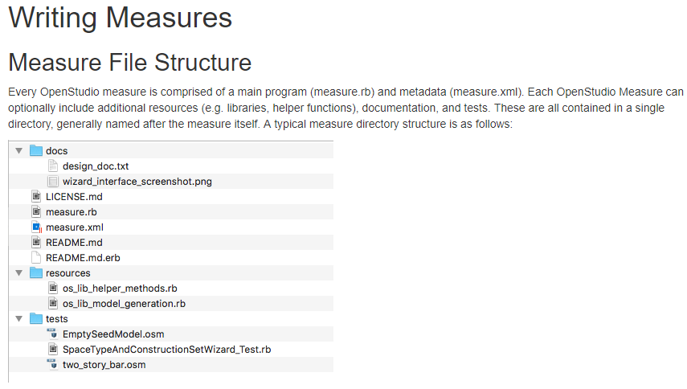
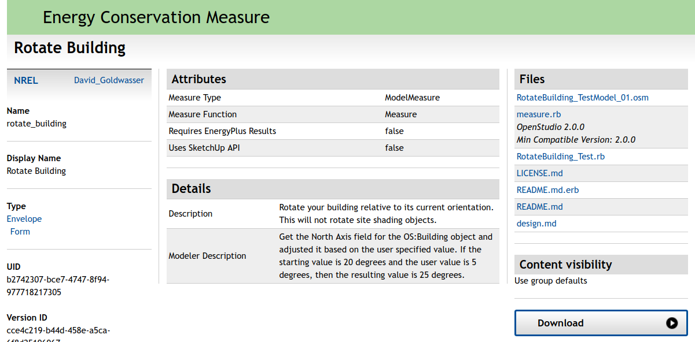
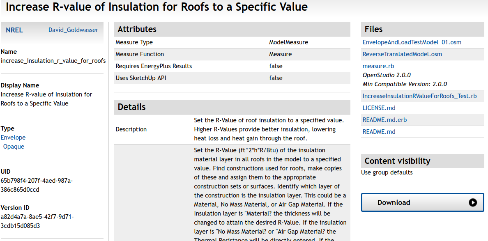
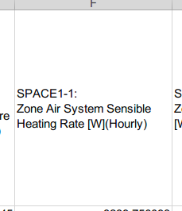
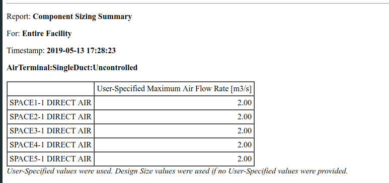
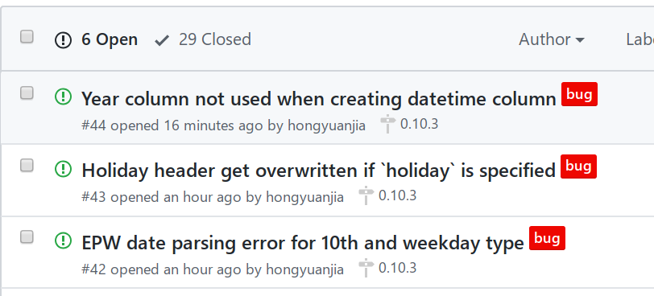

name: self
class: right, middle

```{r initial, include = FALSE}
library(knitr)
library(icon)
opts_chunk$set(
  comment = "#>",
  fig.path = "figure/", fig.align = "center",
  fig.width = 12, fig.show = "hold", fig.height = 8.5,
  cache = FALSE
)

hook_output <- knitr::knit_hooks$get("output")
knit_hooks$set(output = function(x, options) {
  if (!is.null(n <- options$out.lines)) {
    x <- unlist(strsplit(x, "\n", fixed = TRUE))
    if (length(x) > n) {
      # truncate the output
      x <- c(head(x, n), "....", "")
    } else {
      x <- c(x, "")
    }
    x <- paste(x, collapse = "\n") # paste first n lines together
  }
  hook_output(x, options)
})
options(htmltools.dir.version = FALSE)

```

```{r xaringan-themer, include = FALSE}
blue <- "#7D88E8"

library(xaringanthemer)
mono_light(
  base_color = "#23395b",
  text_font_google   = google_font("Muli", "600", "600i"),
  code_font_google   = google_font("Source Code Pro"),
  header_h1_font_size = "45px",
  link_color = blue,
  code_inline_font_size = "0.8em",
  footnote_font_size = "0.6em",
  footnote_position_bottom = "1em"
)
extra_css <- list(
  ".red"   = list(color = "red"),
  ".blue" = list(color = blue),
  ".small" = list("font-size" = "90%"),
  ".big" = list("font-size" = "50px"),
  ".full-width" = list(
    display = "flex",
    width   = "100%",
    flex    = "1 1 auto"
  ),
  "pre" = list(background = "#efefef")
)

write_extra_css(extra_css)
```


# Find me at...

[`r fa_twitter()` @jiahony](http://twitter.com/jiahony)

[`r fa_github()` @hongyuanjia](http://github.com/hongyuanjia)

[`r fa_envelope()` hongyuan.jia@bears-berkeley.sg](mailto:hongyuan.jia@bears-berkeley.sg)

---

name: prerequiste
class: middle, inverse


# We assume:

--

### `r fa_r_project()` &nbsp; You know R and are comfortable with R programming

--

### &nbsp; You know basic EnergyPlus, e.g. how to edit and run a model

---

## Why EnergyPlus?


.footnote[Sources: https://energyplus.net/]

---

## Why EnergyPlus?


.footnote[Sources: https://www.energy.gov/eere/buildings/downloads/openstudio-0]
---

## Why &nbsp;`r fa_r_project()` ?

.big[.center[.blue[Why not?]]]

.center[]

---

## Why &nbsp;`r fa_r_project()` ?


R is great for machine learning, data visualization and analysis, and some areas of scientific computing.

<br>
<br>


.footnote[Sources: https://r4ds.had.co.nz/]

---

## Why &nbsp;`r fa("r-project")` ?

> The goal of reproducible research is to tie specific instructions to data
> analysis and experimental data so that scholarship can be recreated, better
> understood and verified.

.pull-left[

]

.pull-right[

]

.footnote[
Sources:
https://cran.r-project.org/web/views/ReproducibleResearch.html;
https://bookdown.org/yihui/rmarkdown/
]

---

class: inverse middle center

## `r fa_flushed()` &nbsp; Wait! We already have OpenStudio and IDF Editor!!

## Why bother ??

--

## Because...

--

# .blue[Life is hard using OpenStudio and EnergyPlus, sometimes &nbsp; `r fa_grin_squint_tears()`]

---

## `r fa("frown-open")` &nbsp; Sometimes you do not want to learn a new programming language, just for getting familar with OpenStudio Ruby API ...

.center[]

---

## `r fa("frown-open")` &nbsp; Sometimes you wish IDF Editor could do better when you rename an object...

.center[]

---

## `r fa("frown-open")` &nbsp; Sometimes you failed to recall what magics I did to create all those models...

.center[]

---

## `r fa("frown-open")` &nbsp; Sometimes you accidently moved or deleted that "important" csv file used by your model...

.center[]

---

## `r fa("frown-open")` &nbsp; Sometimes you want **REAL** date and time from EnergyPlus' output...

.center[]

---

## `r fa("frown-open")` &nbsp; Sometimes you wish EnergyPlus could sperate key name and output variable for you...

.center[]

---

## `r fa("frown-open")` &nbsp; Sometimes you find it is better to show only the data in specific time...

.center[]

---

## `r fa("frown-open")` &nbsp; Sometmes you don't have enough memory to paste all simulation data into a huge excel file...

.center[]

---

class: inverse middle center

.animated.bounce[

]

## A Toolkit for Using EnergyPlus in R

---

## Features

* Read, parse and modify EnergyPlus Input Data File (IDF)

* Read, parse and modify EnergyPlus Weather File (EPW)

* Query on models, including classes, objects and fields

* Directly add, modify, duplicate, insert, and delete objects of IDF

* Automatically change referenced fields when modifying objects

* Save changed models into standard formats in the same way as IDFEditor distributed along with EnergyPlus

* Run your models and collect the simulation output

* Conduct parametric energy simulations and collect all results in one go

---

## Install and Load

You can install the latest stable release of **eplusr** from CRAN.

```{r cran-install, eval = FALSE}
install.packages("eplusr")
```

**NOTE**: I refactored the implementation of main classes in eplusr `v0.10.0`. 
If your eplusr version is lower than `v0.10.0`, please update it by simplily reinstall it.
After install it, load eplusr by doing:

```{r}
library(eplusr)
```

---

## Install and Load

When loading, eplusr will try to find all EnergyPlus that are installed at the default location.


```{r}
avail_eplus()
```

What if your EnergyPlus installed at a custom location? Just add it:

```{r, eval = FALSE}
use_eplus("your_fancy_path")
```

---

## Install and Load

To check if certain EnergyPlus is located by eplusr:

```{r}
is_avail_eplus(8.8)
```

You can install EnergyPlus using `install_eplus()`.

```{r, eval = FALSE}
install_eplus(8.8)
```

```{r, include = FALSE}
if (!is_avail_eplus(8.8)) install_eplus(8.8)
```


**Note** that `install_eplus()` requires administrative privileges. You have to run R with administrator (or with sudo if you are on macOS or Linux) to make it work if you are not in interactive mode.

You can also download the installer and install it by yourself:

```{r, eval = FALSE}
download_eplus(8.8, dir = "where_to_save")
```

---

class: inverse middle center

# .blue[Idf] Class

### Modify EnergyPlus Model

---

## Imitate your workflow in IDF Editor

.center[]

---

## Read IDF

.blue[\[`r fa_question()`\] How can I open an IDF file?]

```{r read-idf}
(idf <- read_idf("materials/5ZoneWaterLoopHeatPump.idf"))
```
---

## Nomenclature

.blue[\[`r fa_question()`\] What does `Group` and `Class` mean?]

.center[]

.center[**`Group`** --> **`Class`** --> **`Object`** --> **`Field`** --> **`Value`** ]

---

## Basic Info

.blue[\[`r fa_question()`\] Where is my IDF?]

```{r}
idf$path()
```

???

Note that if the model is created from a string or is creating by directly
reading an online file, `NULL` is returned.

--

.blue[\[`r fa_question()`\] Is there any `Location and Climate` related thing in my model?]

--

```{r}
idf$is_valid_group("Location and Climate")
```

--

.blue[\[`r fa_question()`\] Is there any `Schedule:Constant` object in my model?]

--

```{r}
idf$is_valid_class("Schedule:Constant")
```

---

## Basic Info

.blue[\[`r fa_question()`\] How can I get all names of existing groups and classes in my model?]

--

```{r}
str(idf$group_name())
str(idf$class_name())
```

---

## Basic Info

.blue[\[`r fa_question()`\] How can I get all names of existing groups and classes defined by EnergyPlus?]

--

```{r}
str(idf$group_name(all = TRUE))
str(idf$class_name(all = TRUE))
```

---

## Basic Info

.blue[\[`r fa_question()`\] Is there any `Location and Climate` related thing in my model?]

--

```{r}
idf$is_valid_group("Location and Climate")
```

--

.blue[\[`r fa_question()`\] Is there any `Schedule:Constant` object in my model?]

--

```{r}
idf$is_valid_class("Schedule:Constant")
```

---

## Basic Info

.blue[\[`r fa_question()`\] How many construction and zones are there in my model?]

--

```{r}
idf$object_num(c("Construction", "Zone"))
```

--

.blue[\[`r fa_question()`\] Every construction and zone should have a name. Can I get them?]

--

```{r}
idf$object_name(c("Construction", "Zone"))
```

---

## Basic Info


.blue[\[`r fa_question()`\] I don't think object in class `Version` has a name...]

--

```{r}
idf$object_name("Version")
```

--

.blue[\[`r fa_question()`\] If so, how can I distinguish objects that do not have names?]

--

```{r}
idf$object_id(c("Version", "Construction", "Zone"))
```

---

## Object Query

.blue[\[`r fa_question()`\] How can I see if a material is used by other constructions?]

--

```{r out.lines = 15}
idf$object_relation("wd01")
```

---

## Object Query

.blue[\[`r fa_question()`\] How can I see the contents of an object?]

--

```{r}
idf$object("wall-1")
```

---

## Object Query

.blue[\[`r fa_question()`\] What if I want to see all objects in class `Material`?]

--

```{r, out.lines = 15}
idf$Material
```

---

## Object Query

.blue[\[`r fa_question()`\] What if I want to see both a construction and a material?]

--

```{r out.lines = 15}
idf$objects(c("wall-1", "wd01"))
```

---

## Object Query

.blue[\[`r fa_question()`\] What if I want to see a material and all constructions that use it?]

--

```{r out.lines = 15}
idf$objects_in_relation("wd01", "ref_by")
```

---

## Object Query

.blue[\[`r fa_question()`\] But those construction may be also used in surfaces. Can I get all objects that has some relations with that material?]

--

```{r out.lines = 15}
lapply(idf$objects_in_relation("wd01", "ref_by", recursive = TRUE),
       function (x) x$class_name())
```

---

## Add Objects

.blue[\[`r fa_question()`\] How can I add new objects?]

--

```{r, out.lines = 10}
idf$add(
  RunPeriod = list(
    name = "Jan", begin_month = 1, begin_day_of_month = 1,
    end_month = 1, end_day_of_month = 31),
  Material = list("my_mat", "Rough", 0.2, 1.5, 2000, 800)
)
```

---

## Definition

.blue[\[`r fa_question()`\] But I cannot remember all field names...]

--

```{r}
mat_def <- idf$definition("Material")
mat_def
```

---

## Definition

.blue[\[`r fa_question()`\] I don't want to copy from the console...]

--

```{r}
mat_def$field_name()
```

---

## Definition

.blue[\[`r fa_question()`\] So I guess there should be other data I can get from `mat_def`...]

--

```{r iddobj, out.lines = 10}
names(mat_def)
```

`IdfObject` is your friend.

```{r eval = FALSE}
?IddObject
```

---

## Add Objects

.blue[\[`r fa_question()`\] But that may only be useful for interactive
modifcation. How can I add objects programitically?]

```{r}
my_const <- list(Construction = list("my_const", "my_mat"))
idf$add(my_const)
```

--

```{r}
idf$object_relation("my_const", "ref_to")
```

---

## Change Existing Objects

.blue[\[`r fa_question()`\] How can I change existing objects?]

```{r}
idf$set(my_mat = list(name = "new_mat"))
idf$Construction$my_const
```

---

## Change Existing Objects

.blue[\[`r fa_question()`\] How can I change an object that does not have a name? Say `SimulationControl`?]

```{r}
idf$SimulationControl$Do_Zone_Sizing_Calculation <- "No"
idf$SimulationControl$set(Do_System_Sizing_Calculation = "No")
```

---

## Change Existing Objects

.blue[\[`r fa_question()`\] What if I forgot to give a name to a material? How
can I change field values of that object?]

```{r}
idf$object_id("Material")
idf$set(..498 = list(Thickness = 0.3))
```

---

## Rename Objects

.blue[\[`r fa_question()`\] `Old_Name = list(Name = "New_Name")` syntax looks wired. What if I just want to rename an object?]

```{r}
idf$rename(mat_renamed = "new_mat")
idf$Construction$my_const
```

---

## Duplicate Objects

```{r}
names(idf$dup(rep("jan", 11)))
```

---

## BONUS: Paste from IDF Editor (Windows Only)

```{r, eval = FALSE}
idf$paste()
```

---

## Load Objects

.blue[\[`r fa_question()`\] I love copy-- paste...]

--

```{r}
idf$load(
  "Material,
   mat-to-load, !- Name
   rough,       !- Roughness
   0.1,         !- Thickness {m}
   1.5,         !- Conductivity {W/m-K}
   2000,        !- Density {kg/m3}
   800;         !- Specific Heat {J/kg-K}
  "
)
```

---

## Load Objects

You can use either a single string or a character vector.

.pull-left[
```{r, eval = FALSE}
idf$load(
  "Material,
   mat-to-load,
   rough,
   0.1,
   1.5,
   2000,
   800;
  "
)
```
]

.pull-right[
```{r, eval = FALSE}
idf$load(c(
  "Material,",
  "mat-to-load,",
  "rough,",
  "0.1,",
  "1.5,",
  "2000,",
  "800;"
))
```
]

---

## Load Objects

.blue[\[`r fa_question()`\] You know, R is fameous for `data.frame`...]

--

```{r}
idf$load(
  data.frame(class = "Material", index = 1:6,
             value = I(list("mat-in-df", "rough", 0.1, 0.5, 2000, 800)),
             stringsAsFactors = FALSE
  )
)
```

---

## Data Extraction

.blue[\[`r fa_question()`\] No one would like to manually create that string or data.frame...]

--

```{r}
idf$to_string("mat_renamed", header = FALSE)
```

---

```{r}
idf$to_table("mat_renamed")
```

---

## Insert Objects

.blue[\[`r fa_question()`\] What if I want to directly insert objects from another `Idf` or design days from an `.ddy` file?]

--

```{r}
ddy <- read_idf(file.path("materials/USA_IL_Chicago-OHare.Intl.AP.725300_TMY3.ddy"), 8.8)

names(idf$insert(ddy$SizingPeriod_DesignDay))
```

---

## Delete Objects

.blue[\[`r fa_question()`\] How can I delete objects?]

```{r del, error = TRUE}
idf$del("mat-to-load", idf$object_id("SizingPeriod:DesignDay", simplify = TRUE))
```
---

## Delete Objects

.blue[\[`r fa_question()`\] What if I try to delete a material that is used by an construction?]

```{r del-err, error = TRUE}
idf$del("mat_renamed")
```

---

## Delete Objects

.blue[\[`r fa_question()`\] What if I want to delete the material and all constructions that use it?]

```{r}
idf$del("mat_renamed", .ref_by = TRUE)
```

---

## Delete Objects

.blue[\[`r fa_question()`\] What if I want to delete a construction and all materials it uses?]

```{r del-ref-to, eval = FALSE}
idf$del("my_const", .ref_to = TRUE)
```

---

## Check for errors

.blue[\[`r fa_question()`\] How can I check for possible errors in my model just like IDF Editor does?]

--

```{r}
idf$validate()
```

---

.blue[\[`r fa_question()`\] How kinds of checkings are there?]

```{r}
eplusr_option("validate_level")
str(level_checks(eplusr_option("validate_level")))
```
---

## Save model

.blue[\[`r fa_question()`\] I am not quite sure if I made modifcations to the model...]

--

```{r}
idf$is_unsaved()
```

--

```{r save-err, error = TRUE}
idf$save(file.path(tempdir(), "test.idf"))
```

---

name: prerequiste
class: middle, inverse

## `r fa_flushed()` &nbsp; No big deal so far...

--

## .blue[`r fa_rocket()` &nbsp; R is a programming language!]

---

## Leverage the power of R

.center[]

.footnote[Source: https://bcl.nrel.gov/node/84693]

---

## Demo

```{r}
source("measures/rotate.R")

rotate_building(idf, 30)
```

---

## Leverage the power of R

.center[]

.footnote[Source: https://bcl.nrel.gov/node/84677]

---

## Demo

```{r}
source("measures/roof_r_value.R")

align_roof_r_value(idf, 5)
```

---

class: inverse middle center

# .blue[EplusJob] Class

### Run and Collect Output

---

## Run and Collect Output

.blue[\[`r fa_question()`\] Finally! How can I run my simulaion?]

```{r run, out.lines = 14}
idf <- read_idf("materials/5ZoneWaterLoopHeatPump.idf")

# make sure objects in `RunPeriod` class take effect
idf$SimulationControl$Run_Simulation_for_Weather_File_Run_Periods <- "Yes"

# save the model before run
idf$save(file.path(tempdir(), "example.idf"), overwrite = TRUE)
```

---

```{r, out.lines = 20}
path_epw <- file.path("materials/USA_IL_Chicago-OHare.Intl.AP.725300_TMY3.epw")
job <- idf$run(path_epw, dir = tempdir())
```

---

## Run and Collect Output

.blue[\[`r fa_question()`\] How can I see if there are errors during my simulation?]

```{r}
class(job)
names(job)
job
```

---

```{r}
job$errors()
```

---

## Run and Collect Output

.blue[\[`r fa_question()`\] How can I retrieve my simulation results?]

```{r}
job$report_data()
```

---

## Run and Collect Output

.blue[\[`r fa_question()`\] What are the advantages of using `$report_data()`?]

```{r}
args(job$report_data)
```

---

## Introducing Tidy Data

Tidy data is a standard way of mapping the meaning of a dataset to its
structure. A dataset is messy or tidy depending on how rows, columns and tables
are matched up with observations, variables and types. In tidy data:

* Each variable forms a column.

* Each observation forms a row.

* Each type of observational unit forms a table.

.footnote[Source: https://www.jstatsoft.org/article/view/v059i10]

---

## Introducing Tidy Data

.center[]

.center[EnergyPlus always gives untidy data]

---

.center[]

```{r}
first_line <- suppressWarnings(job$report_data()[1])
str(first_line)
```

`SPACE1-1: Zone Air System Sensible Heating Rate [W](Hourly)`:

* .blue[key_value] --> `SPACE1-1`
* .blue[name] --> `Zone Air System Sensible Heating Rate`
* .blue[units] --> `W`

---

.blue[Get all available report variable keys and names]

```{r}
str(job$report_data_dict())
```

---

.blue[Get air temperature for all zones]

```{r, eval = FALSE}
job$report_data(name = "zone air temperature")
```

--

.blue[Get air temperature for zone `SPACE1-1` only]

```{r, eval = FALSE}
job$report_data("space1-1", "zone air temperature")
```

---

.blue[Directly use `$report_data_dict()` to extract results]

```{r}
dict <- job$report_data_dict()
str(job$report_data(dict[is_meter == 1]))
```

---

.blue[Real `DateTime`]

```{r}
str(job$report_data("space1-1", "zone air temperature")$datetime)
```

--

.blue[Change the year value of returned date time]

```{r, eval = FALSE}
job$report_data(year = 2017)
```

--

.blue[Change the time zone of returned date time]

```{r}
lubridate::tz(job$report_data(tz = "Asia/Singapore")$datetime)
```

---

.blue[Make sure start day of week matches!]

.pull-left[
```{r}
idf$RunPeriod[[1]]$value(1:6)
```
]

.pull-right[
```{r}
idf$RunPeriod[[2]]$value(1:6)
```
]

---

```{r, out.lines = 20}
idf$object("clg-setp-sch")
```

---

```{r, fig.height = 6, out.height="50%"}
temp <- job$report_data("space1-1", "zone air temperature", all = TRUE, year = 2018)
library(ggplot2)
temp %>%
  ggplot() +
  geom_line(aes(datetime, value)) +
  facet_wrap(vars(month, day), labeller = "label_both", scales = "free_x")
```

---

.blue[Precisely control time period]

Get the total cooling rate power of AHU named `Heat Pump Cooling Mode AHU1` at
11 a.m for the first day of all runperiod, tag this simulation as case
`example`, and return all possible output columns.

```{r, out.lines = 10}
job$report_data(
  key_value = "heat pump cooling mode ahu1",
  name = "cooling coil total cooling rate", case = "example",
  all = TRUE, simulation_days = 1, hour = 11, minute = 0) %>%
str()
```

---

.blue[Extract tabular data using `$tabular_data()`]

.center[]

```{r, eval = FALSE}
job$tabular_data(
  report_name = "ComponentSizingSummary",
  report_for = "entire facility",
  table_name = "airterminal:singleduct:uncontrolled",
  column_name = "user-specified maximum air flow rate",
  row_name = "space5-1 direct air"
)
```

---

## Other useful data you can retrieve from EnergyPlus SQL output

.blue[Get summary data of all materials]

```{r}
str(job$read_table("Materials"))
```

---

.blue[Get summary data of all constructions]

```{r}
str(job$read_table("Constructions"))
```

---

.blue[Get summary data of all surfaces]

```{r}
str(job$read_table("Surfaces"))
```

---

.blue[Get summary data of all zones]

```{r}
str(job$read_table("Zones"))
```

---

.blue[Other resources]

```{r}
job$list_table()
```

---

class: inverse middle center

# .blue[ParametricJob] Class

### Conduct Parametric Simulations

---

## Create a parametric job

```{r}
param <- param_job(idf, "materials/USA_IL_Chicago-OHare.Intl.AP.725300_TMY3.epw")
param
```
---

## Apply measures

.blue[Apply a single measure]

```{r}
rotate <- function (idf, degree) {
    rotate_building(idf, degree)
    idf
}

param$apply_measure(rotate, seq(0, 180, 30), .names = paste0("degree_", seq(0, 180, 30)))
```

---

.blue[Apply multiple measures]

```{r}
# get all combinations
comb <- cross_df(list(degree = seq(0, 180, 60), r_value = c(3.55, 3.7)))
comb$name <- paste("case", comb$degree, comb$r_value, sep = "_")

rotate_and_align_r_value <- function (idf, degree, expect_r_value) {
    rotate_building(idf, degree)

    align_roof_r_value(idf, expect_r_value)

    idf
}

param$apply_measure(rotate_and_align_r_value, comb$degree, comb$r_value, .names = comb$name)
```

---

## Run Parametric Simulations

```{r, results = "hide"}
param$run(tempdir())
```

---

## Extract Simulation Output

```{r, out.lines = 18}
param$errors()
```

---

.blue[Does building orientation and roof thermal property influence sensible cooling loads??]

```{r, eval = FALSE}
cooling_rate <- param$report_data(NULL, name = "Zone Air System Sensible Cooling Rate", month = 7, all = TRUE)

# exclude design day data
cooling_rate_nodes <- cooling_rate[!grepl("DesignDay", day_type)]

# plot
cooling_rate_nodes %>%
    ggplot() +
    geom_line(aes(datetime, value, group = case, color = case)) +
    facet_wrap(vars(key_value)) +
    scale_y_continuous(name = "Air System Sensible Cooling Rate / W")
```

---

```{r, echo = FALSE}
cooling_rate <- param$report_data(NULL, name = "Zone Air System Sensible Cooling Rate", month = 7, all = TRUE)

# exclude design day data
cooling_rate_nodes <- cooling_rate[!grepl("DesignDay", day_type)]

# plot
cooling_rate_nodes %>%
    ggplot() +
    geom_line(aes(datetime, value, group = case, color = case)) +
    facet_wrap(vars(key_value)) +
    scale_y_continuous(name = "Air System Sensible Cooling Rate / W")
```

---

class: inverse middle center

# .blue[Epw] Class

### Modify EnergyPlus Weather

---

## Read EPW file

```{r}
epw <- read_epw(path_epw)
epw
```

---

## Query and Modify Headers

.blue[Get location data]

```{r}
str(epw$location())
```

---

.blue[Modify location data]

```{r}
str(epw$location(city = "my_city", state_province = "my_state", country = "my_country"))
```

---

.blue[Get design condition data]

```{r, out.lines = 15}
str(epw$design_condition())
```

---

```{r, out.lines = 15}
epw$typical_extreme_period()
```

---

```{r, out.lines = 15}
str(epw$ground_temperature())
```

---

.blue[Get leap year flag, daylight saving time and holidays]

```{r, out.lines = 15}
epw$holiday()
```

---

.blue[Add daylight saving time period]

```{r, out.lines = 15}
epw$holiday(dst = c("3.10", "11.3"))
epw$holiday(dst = c("2nd Sunday in March", "1st Sunday in November"))
```

---

.blue[Add holidays]

```{r, out.lines = 15}
epw$holiday(holiday = list(name = c("New Year's Day", "Christmas Day"), day = c("1.1", "25 Dec")))
```

---

.blue[Get and modify comments]

```{r, out.lines = 15}
epw$comment1()
epw$comment2()
```

```{r, out.lines = 15}
epw$comment1("new comment1")
epw$comment2("new comment2")
```

---

.blue[Get total number of data periods]

```{r, out.lines = 15}
epw$num_period()
```

--

.blue[Get number of observations per hour]

```{r, out.lines = 15}
epw$interval()
```

--

.blue[Get data period]

```{r, out.lines = 15}
epw$period()
```

---

## Weather Data Specifications

```{r, out.lines = 15}
str(epw$missing_code())
```

---

```{r, out.lines = 15}
str(epw$initial_missing_value())
```

---

```{r, out.lines = 15}
epw$range_exist()
```

---

```{r, out.lines = 15}
epw$range_valid()
```

---

```{r, out.lines = 15}
epw$fill_action("missing")
```

---

```{r, out.lines = 15}
epw$fill_action("out_of_range")
```

---

## Get Weather Data

```{r, out.lines = 15}
str(epw$data(1))
```

---

```{r, out.lines = 15}
weekdays(epw$data(1)$datetime[[1]])
epw$period(1)$start_day_of_week
```

---

## Get Abnormal Weather Data

```{r, out.lines = 15}
epw$abnormal_data(keep_all = FALSE)
```

---

## Get Redundant Weather Data

```{r, out.lines = 15}
epw$redundant_data()
```

---

## Modify Weather Data In-Place

```{r, out.lines = 15}
epw$add_unit()
dry_bulb <- epw$data()$dry_bulb_temperature
head(dry_bulb)
```

```{r}
units(dry_bulb) <- with(units::ud_units, "kelvin")
head(dry_bulb)
```

---

## Modify Weather Data In-Place

```{r, out.lines = 15}
epw$make_na(missing = TRUE)
str(epw$abnormal_data(keep_all = FALSE))
```

---

## Set Weather Data

```{r, eval = FALSE}
epw$add(data, realyear = FALSE, name = NULL, start_day_of_week = NULL, after = 0L, warning = TRUE)
epw$set(data, realyear = FALSE, name = NULL, start_day_of_week = NULL, period = 1L, warning = TRUE)
epw$delete(period)
```

---

## Save Weather File

```{r, eval = FALSE}
epw$save()
```

For more info, see `?Epw`

---

## Note on Using Leap-Year AMY Weather Data in EnergyPlus?

See [#32](https://github.com/hongyuanjia/eplusr/issues/32)

```{r}
#     version type_runperiod type_epw num_row num_leap
#  1:     8.8            tmy  nonleap    8760       24
#  2:     9.0            tmy  nonleap    8760       24
#  3:     9.1            tmy  nonleap    8760       24
#  4:     8.8            amy  nonleap    8760       24
#  5:     9.0            amy  nonleap    8760       24
#  6:     9.1            amy  nonleap    8760       24
#  7:     8.8            tmy     leap    8784       48
#  8:     9.0            tmy     leap    8784       48
#  9:     9.1            tmy     leap    8760       24
# 10:     8.8            amy     leap    8784       48
# 11:     9.0            amy     leap    8784       48
# 12:     9.1            amy     leap    8784       48
```

---

class: inverse middle center

.animated.bounce[

]

## Summary

---

## Class structure

.pull-left[
* `Idd` class --> Model definition

* `IddObject` class --> Single class definition

* `Idf` class --> Model itself

* `IdfObject` class --> Single object

* `Epw` class --> Weather file

* `EPlusJob` class --> Single simulation

* `ParametricJob` class --> Parametric simulations
]

.pull-right[

]

---

## Future plan

* C++ parser for IDD, IDF, and EPW

* Integration with Stan (sensitivity analysis, Bayesian Calibration)

* HVAC builder based on EnergyPlus example files

* Version updater

* Eplusr Specific option header?

* A Shiny-based GUI?

* Friendly schedule generator?

---

## Call for Contributors

.center[]


---

class: right, middle

# Thanks!


[`r fa_twitter()` @jiahony](http://twitter.com/jiahony)

[`r fa_github()` @hongyuanjia](http://github.com/hongyuanjia)

[`r fa_envelope()` hongyuan.jia@bears-berkeley.sg](mailto:hongyuan.jia@bears-berkeley.sg)
