name: self
class: right, middle

```{r initial, include = FALSE}
library(knitr)
library(icon)
opts_chunk$set(
  comment = "#>",
  fig.path = "figure/", cache.path = "cache/", fig.align = "center",
  fig.width = 12, fig.show = "hold", fig.height = 8.5,
  cache = FALSE, external = TRUE, dev = "svglite"
)

hook_output <- knitr::knit_hooks$get("output")
knit_hooks$set(output = function(x, options) {
  if (!is.null(n <- options$out.lines)) {
    x <- unlist(strsplit(x, "\n", fixed = TRUE))
    if (length(x) > n) {
      # truncate the output
      x <- c(head(x, n), "....", "")
    } else {
      x <- c(x, "")
    }
    x <- paste(x, collapse = "\n") # paste first n lines together
  }
  hook_output(x, options)
})
options(htmltools.dir.version = FALSE)

```

```{r xaringan-themer, include = FALSE}
blue <- "#7D88E8"

library(xaringanthemer)
mono_light(
  base_color = "#23395b",
  text_font_google   = google_font("Muli", "600", "600i"),
  code_font_google   = google_font("Source Code Pro"),
  header_h1_font_size = "45px",
  link_color = blue,
  code_inline_font_size = "0.8em",
  footnote_font_size = "0.6em",
  footnote_position_bottom = "1em"
)
extra_css <- list(
  ".red"   = list(color = "red"),
  ".blue" = list(color = blue),
  ".small" = list("font-size" = "90%"),
  ".big" = list("font-size" = "50px"),
  ".full-width" = list(
    display = "flex",
    width   = "100%",
    flex    = "1 1 auto"
  ),
  "pre" = list(background = "#efefef")
)

write_extra_css(extra_css)
```


# Find me at...

[`r fa_twitter()` @jiahony](http://twitter.com/jiahony)

[`r fa_github()` @hongyuanjia](http://github.com/hongyuanjia)

[`r fa_envelope()` hongyuan.jia@bears-berkeley.sg](mailto:hongyuan.jia@bears-berkeley.sg)

---

name: prerequiste
class: middle, inverse


# We assume:

--

### `r fa_r_project()` &nbsp; You know R and are comfortable with R programming

--

### &nbsp; You know basic EnergyPlus, e.g. how to edit and run a model

---

## Why EnergyPlus?

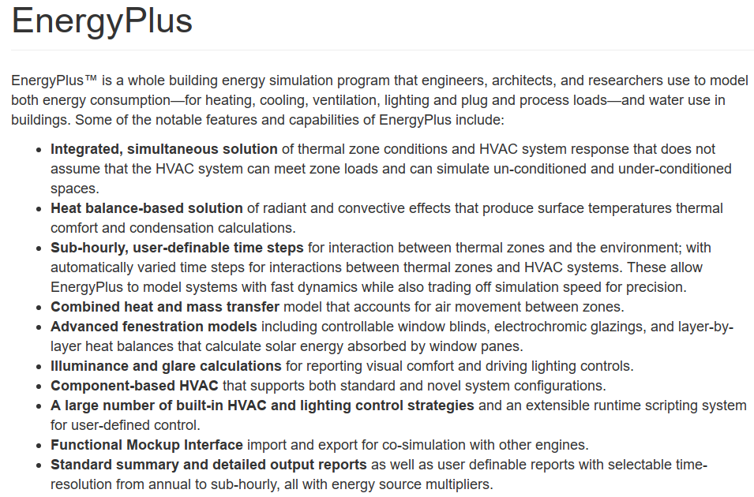

.footnote[Sources: https://energyplus.net/]

---

## Why EnergyPlus?

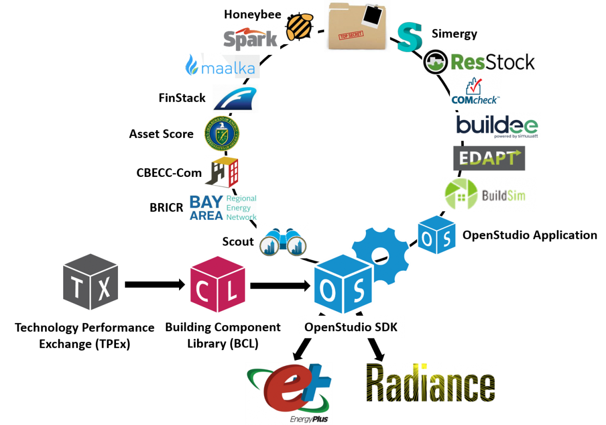

.footnote[Sources: https://www.energy.gov/eere/buildings/downloads/openstudio-0]
---

## Why &nbsp;`r fa_r_project()` ?

.big[.center[.blue[Why not?]]]

.center[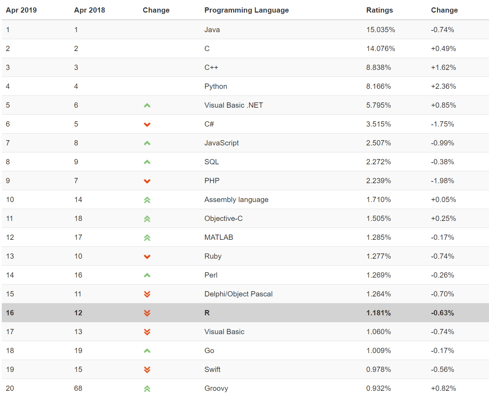]

---

## Why &nbsp;`r fa_r_project()` ?


R is great for machine learning, data visualization and analysis, and some areas of scientific computing.

<br>
<br>

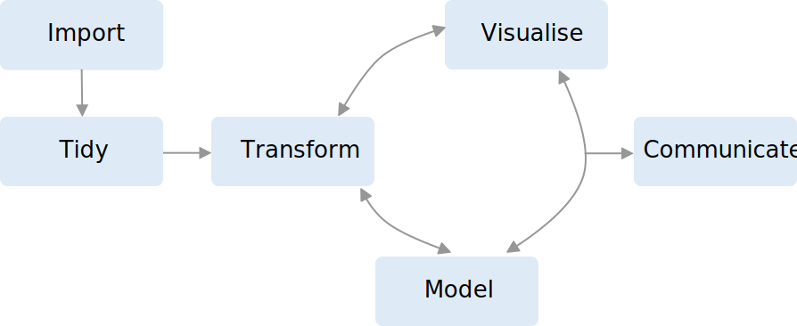


.footnote[Sources: https://r4ds.had.co.nz/]

---

## Why &nbsp;`r fa("r-project")` ?

> The goal of reproducible research is to tie specific instructions to data
> analysis and experimental data so that scholarship can be recreated, better
> understood and verified.

.pull-left[

]

.pull-right[

]

.footnote[
Sources:
https://cran.r-project.org/web/views/ReproducibleResearch.html;
https://bookdown.org/yihui/rmarkdown/
]

---

class: inverse middle center

## `r fa_flushed()` &nbsp; Wait! We already have OpenStudio and IDF Editor!!

## Why bother ??

--

## Because...

--

# .blue[Life is hard using OpenStudio and EnergyPlus, sometimes &nbsp; `r fa_grin_squint_tears()`]

---

## `r fa("frown-open")` &nbsp; Sometimes you do not want to learn a new programming language Ruby just for getting familar with OpenStudio Ruby API ...

.center[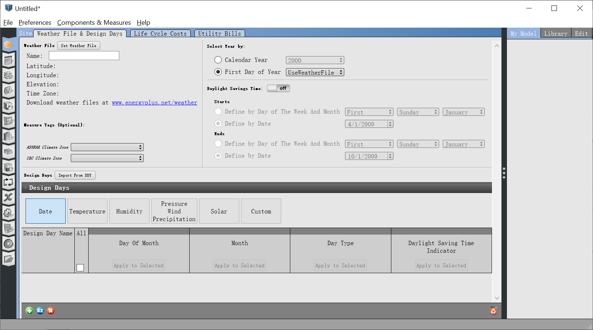]

---

## `r fa("frown-open")` &nbsp; Sometimes you wish IDF Editor could do better when you rename an object...

.center[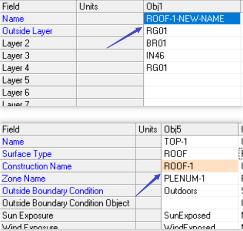]

---

## `r fa("frown-open")` &nbsp; Sometimes you failed to recall what magics I did to create all those models...

.center[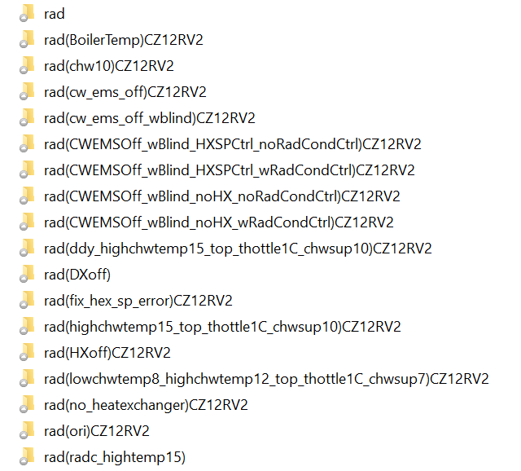]

---

## `r fa("frown-open")` &nbsp; Sometimes you accidently moved or deleted that "important" csv file used by your model...

.center[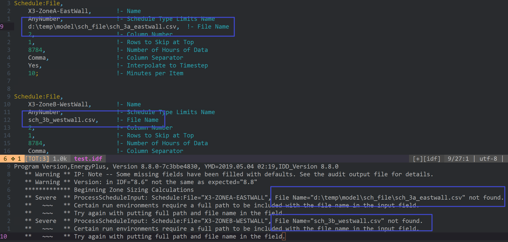]

---

## `r fa("frown-open")` &nbsp; Sometimes you want **REAL** date and time from EnergyPlus' output...

.center[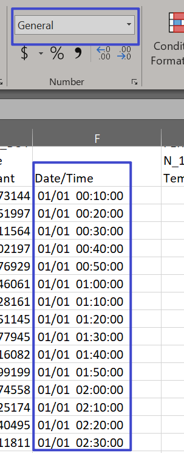]

---

## `r fa("frown-open")` &nbsp; Sometimes you wish EnergyPlus could sperate key name and output variable for you...

.center[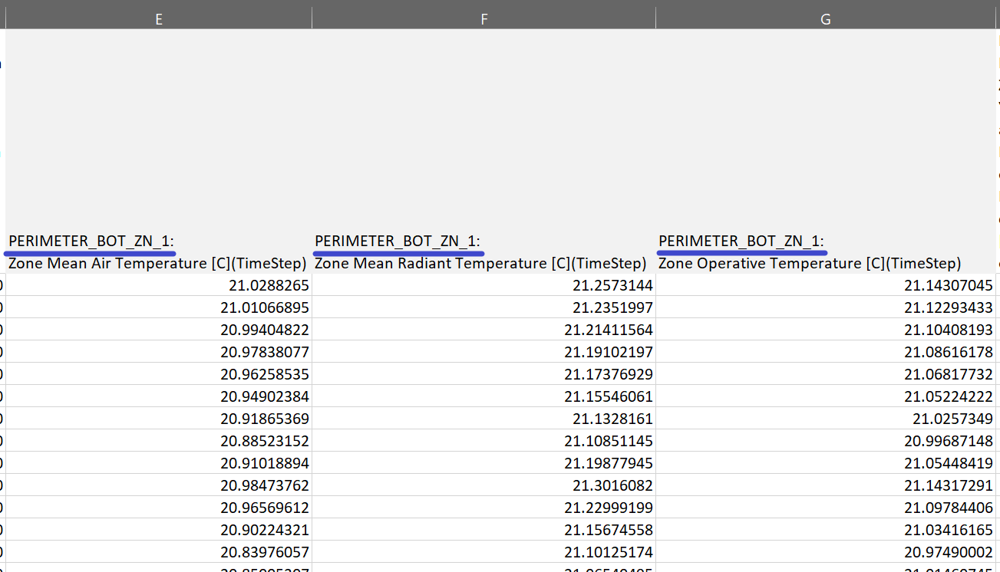]

---

## `r fa("frown-open")` &nbsp; Sometimes you find it is better to show only the data in specific time...

.center[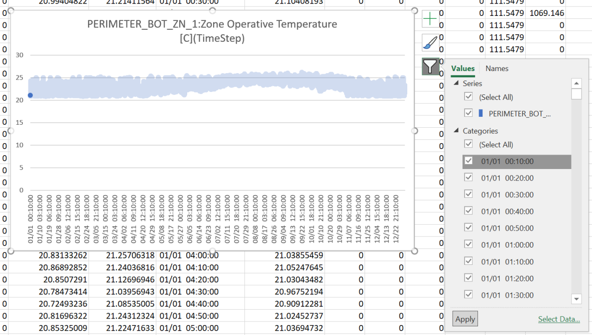]

---

## `r fa("frown-open")` &nbsp; Sometmes you don't have enough memory to paste all simulation data into a huge excel file...

.center[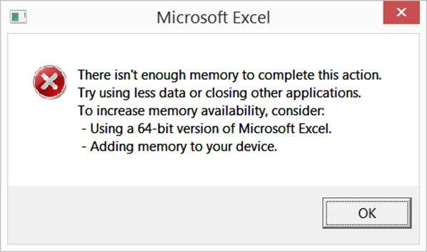]

---

class: inverse middle center

.animated.bounce[

]

## A Toolkit for Using EnergyPlus in R

---

## Features

* Read, parse and modify EnergyPlus Input Data File (IDF)

* Read, parse and modify EnergyPlus Weather File (EPW)

* Query on models, including classes, objects and fields

* Directly add, modify, duplicate, insert, and delete objects of IDF

* Automatically change referenced fields when modifying objects

* Save changed models into standard formats in the same way as IDFEditor distributed along with EnergyPlus

* Run your models and collect the simulation output

* Conduct parametric energy simulations and collect all results in one go

---

## Install and Load

You can install the latest stable release of **eplusr** from CRAN.

```{r cran-install, eval = FALSE}
install.packages("eplusr")
```

**NOTE**: I refactored the implementation of main classes in eplusr `v0.10.0`. 
If your eplusr version is lower than `v0.10.0`, please update it by simplily reinstall it.
After install it, load eplusr by doing:

```{r}
library(eplusr)
```

---

## Install and Load

When loading, eplusr will try to find all EnergyPlus that are installed at the default location.


```{r}
avail_eplus()
```

What if your EnergyPlus installed at a custom location? Just add it:

```{r, eval = FALSE}
use_eplus("your_fancy_path")
```

---

## Install and Load

To check if certain EnergyPlus is located by eplusr:

```{r}
is_avail_eplus(8.8)
```

You can install EnergyPlus using `install_eplus()`.

```{r, eval = FALSE}
install_eplus(8.8)
```

**Note** that `install_eplus()` requires administrative privileges. You have to run R with administrator (or with sudo if you are on macOS or Linux) to make it work if you are not in interactive mode.

You can also download the installer and install it by yourself:

```{r, eval = FALSE}
download_eplus(8.8, dir = "where_to_save")
```

---

class: inverse middle center

.center[.big[`Idf`]]

---

## Imitate your workflow in IDF Editor

.center[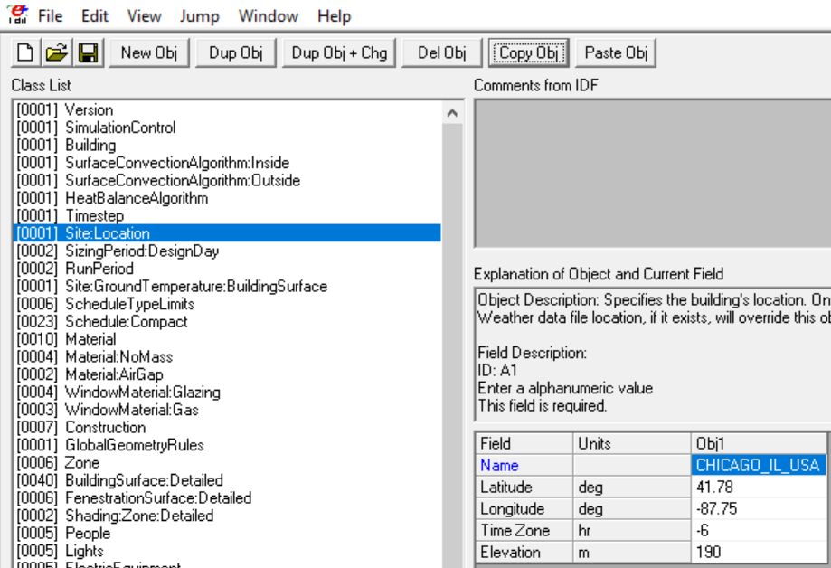]

---

## Read IDF

.blue[\[`r fa("question")`\] How can I open an IDF file?]

```{r read-idf, eval = FALSE}
(idf <- read_idf("materials/5ZoneWaterLoopHeatPump.idf"))
```

```{r read-idf-raw, out.ines = 10, echo = FALSE}
path_idf <- "https://raw.githubusercontent.com/hongyuanjia/eplusrIntro/master/materials/5ZoneWaterLoopHeatPump.idf"
(idf <- read_idf(path_idf))
```
---

## Nomenclature

.blue[\[`r fa("question")`\] How does `Group` and `Class` mean?]

.center[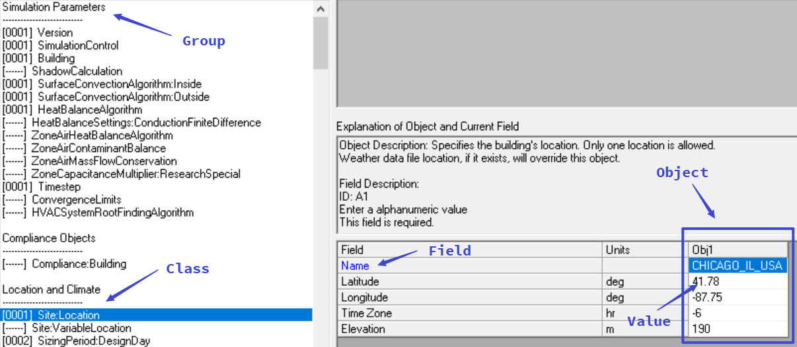]

.center[**`Group`** --> **`Class`** --> **`Object`** --> **`Field`** --> **`Value`** ]

---

## Basic Info

.blue[\[`r fa("question")`\] Where is my IDF?]

```{r}
idf$path()
```

--

.blue[\[`r fa("question")`\] Is there any `Location and Climate` related thing in my model?]

--

```{r}
idf$is_valid_group("Location and Climate")
```

--

.blue[\[`r fa("question")`\] Is there any `Schedule:Constant` object in my model?]

--

```{r}
idf$is_valid_class("Schedule:Constant")
```

---

## Basic Info

.blue[\[`r fa("question")`\] How can I get all names of existing groups and classes in my model?]

--

```{r}
str(idf$group_name())
str(idf$class_name())
```

---

## Basic Info

.blue[\[`r fa("question")`\] How can I get all names of existing groups and classes defined by EnergyPlus?]

--

```{r}
str(idf$group_name(all = TRUE))
str(idf$class_name(all = TRUE))
```

---

## Basic Info

.blue[\[`r fa("question")`\] Is there any `Location and Climate` related thing in my model?]

--

```{r}
idf$is_valid_group("Location and Climate")
```

--

.blue[\[`r fa("question")`\] Is there any `Schedule:Constant` object in my model?]

--

```{r}
idf$is_valid_class("Schedule:Constant")
```

---

## Basic Info

.blue[\[`r fa("question")`\] How many construction and zones are there in my model?]

--

```{r}
idf$object_num(c("Construction", "Zone"))
```

--

.blue[\[`r fa("question")`\] Every construction and zone should have a name. Can I get them?]

--

```{r}
idf$object_name(c("Construction", "Zone"))
```

---

## Basic Info


.blue[\[`r fa("question")`\] I don't think object in class `Version` has a name...]

--

```{r}
idf$object_name("Version")
```

--

.blue[\[`r fa("question")`\] If so, how can I distinguish objects that do not have names?]

--

```{r}
idf$object_id(c("Version", "Construction", "Zone"))
```

---

## Object Query

.blue[\[`r fa("question")`\] How can I see if a material is used by other constructions?]

--

```{r out.lines = 15}
idf$object_relation("wd01")
```

---

## Object Query

.blue[\[`r fa("question")`\] How can I see the contents of an object?]

--

```{r}
idf$object("wall-1")
```

---

## Object Query

.blue[\[`r fa("question")`\] What if I want to see all objects in class `Material`?]

--

```{r, out.lines = 15}
idf$Material
```

---

## Object Query

.blue[\[`r fa("question")`\] What if I want to see both a construction and a material?]

--

```{r out.lines = 15}
idf$objects(c("wall-1", "wd01"))
```

---

## Object Query

.blue[\[`r fa("question")`\] What if I want to see a material and all constructions that use it?]

--

```{r out.lines = 15}
idf$objects_in_relation("wd01", "ref_by")
```

---

## Object Query

.blue[\[`r fa("question")`\] But those construction may be also used in surfaces. Can I get all objects that has some relations with that material?]

--

```{r out.lines = 15}
lapply(idf$objects_in_relation("wd01", "ref_by", recursive = TRUE),
       function (x) x$class_name())
```

---

## Add Objects

```{r, out.lines = 10}
idf$add(
  RunPeriod = list(
    name = "Jan", begin_month = 1, begin_day_of_month = 1,
    end_month = 1, end_day_of_month = 31),
  Material = list("my_mat", "Rough", 0.2, 1.5, 2000, 800)
)
```

---

## Definition

.blue[\[`r fa("question")`\] But how can I remember all field names?]

--

```{r}
mat_def <- idf$definition("Material")
mat_def
```

---

## Definition

.blue[\[`r fa("question")`\] I don't want to copy from the console!]

--

```{r}
mat_def$field_name()
```

---

## Definition

.blue[\[`r fa("question")`\] So I guess there should be other data I can get from `mat_def`...]

--

`IdfObject` is your friend.

```{r eval = FALSE}
?IddObject
```

---

## Add Objects

```{r}
my_const <- list(Construction = c("my_const", "my_mat"))
idf$add(my_const)
```

--

```{r}
idf$object_relation("my_const", "ref_to")
```

---

## Change Existing Objects

```{r}
idf$set(my_mat = list(name = "new_mat"))
idf$Construction$my_const
```

---

## Rename Objects

```{r}
idf$rename(mat_renamed = "new_mat")
idf$Construction$my_const
```

---

## Duplicate Objects

```{r}
names(idf$dup(rep("jan", 11)))
```

---

## BONUS: Paste from IDF Editor (Windows Only)

```{r, eval = FALSE}
idf$paste()
```

---

## Load Objects

.blue[\[`r fa("question")`\] I love copy-- paste...]

--

```{r}
idf$load(
  "Material,
   mat-to-load, !- Name
   rough,       !- Roughness
   0.1,         !- Thickness {m}
   1.5,         !- Conductivity {W/m-K}
   2000,        !- Density {kg/m3}
   800;         !- Specific Heat {J/kg-K}
  "
)
```

---

## Load Objects

.pull-left[
```{r, eval = FALSE}
idf$load(
  "Material,
   mat-to-load,
   rough,
   0.1,
   1.5,
   2000,
   800;
  "
)
```
]

.pull-right[
```{r, eval = FALSE}
idf$load(c(
  "Material,",
  "mat-to-load,",
  "rough,",
  "0.1,",
  "1.5,",
  "2000,",
  "800;"
))
```
]

---

## Load Objects

.blue[\[`r fa("question")`\] You know, R is fameous for `data.frame`...]

--

```{r}
idf$load(
  data.frame(class = "Material", index = 1:6,
             value = I(list("mat-in-df", "rough", 0.1, 0.5, 2000, 800)),
             stringsAsFactors = FALSE
  )
)
```

---

## Data Extraction

.blue[\[`r fa("question")`\] No one would like to manually create that string or data.frame...]

--

```{r}
idf$to_string("mat_renamed", head = FALSE)
```

---

```{r}
kable(idf$to_table("mat_renamed"))
```

---

## Insert Objects

.blue[\[`r fa("question")`\] What if I want to directly insert objects from another `Idf`?]

--

```{r, eval = FALSE, include=FALSE}
idf$insert("mat_renamed")
```

---

## Delete Objects

```{r del-err, error = TRUE}
idf$del("mat_renamed")
```

---

## Delete Objects

.blue[\[`r fa("question")`\] What if I want to delete the material and all constructions that use it?]

```{r, error=TRUE}
idf$del("mat_renamed", .ref_by = TRUE)
```

---

## Reproduce


.pull-right[

* Use version control
* R Markdown
]

---

## Reproduce

## goal

Simulation is not the goal, collecting the simulation results is.


---

## Validate

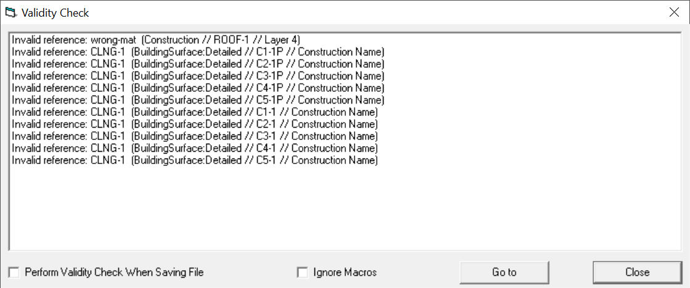

---

## Other approach
eppy:

* Edit only one version of model. Lacking support for EPW. Lacking functions to collect results

* openstudio. The powerhouse. Use its sketchup plugin to build building Geometry. Go for it if you love gui.

* openstudio SDK. Highly inspired. Ruby binding. Too heavy. Ruby is not for data analysis.
jeplus

---

## Tidy data

csv screenshot, variable name

A Toolkit for Using Whole Building Simulation Program 'EnergyPlus'

Tidy data is a standard way of mapping the meaning of a dataset to its structure. A dataset is messy or tidy depending on how rows, columns and tables are matched up with observations, variables and types. In tidy data:

* Each variable forms a column.

* Each observation forms a row.

* Each type of observational unit forms a table.

EnergyPlus always gives untidy data.


---

## custom weather

---

## How can I change the weather data?
Should compliance with the Runperiod headers and others

---

## Future plan

* C++ parser for IDD, IDF, and EPW (Openstudio pics)

* Integration with Stan

* HVAC builder based on EnergyPlus example files

* Eplusr Specific option header?

* Version Updater

* A Shiny-based GUI?

---

## Class structure

.pull-left[
* `Idd` class --> Model definition

* `Idd` class --> Model itself

* `Epw` class --> Weather file

* `EPlusJob` class --> Single simulation

* `ParametricJob` class --> Parametric simulations
]

.pull-right[
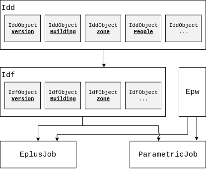
]

---

### EnergyPlus config

I want to install the latest version of EnergyPlus (currently 9.1)

```{r eval = FALSE}
install_eplus()
```

--
What versions of EnergyPlus have been install on my computer?

```{r}
avail_eplus()
```

--

What if I installed EnergyPlus at a different location? Let's say `D:\software\EnergyPlusV9-0-1`.  Am I able to use that?

```{r use-eplus, eval = FALSE}
use_eplus("D:/software/EnergyPlusV9-0-1")
```

---

### Read an example file


---

## Implementation detailed

Use vim to show. Demo


## Contributors
